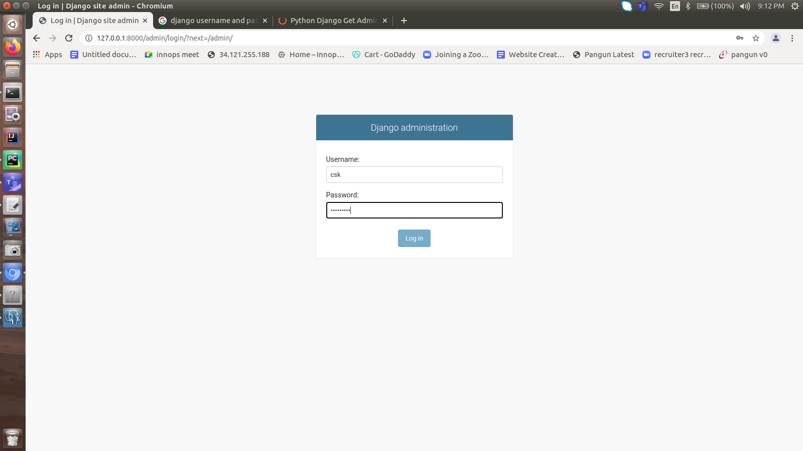

## Celery-Django-Postgres-Redis
### Installing postgres in ubuntu
[Ref] https://www.postgresql.org/download/linux/ubuntu/
    
    # Create the file repository configuration:
    sudo sh -c 'echo "deb http://apt.postgresql.org/pub/repos/apt $(lsb_release -cs)-pgdg main" > /etc/apt/sources.list.d/pgdg.list'
    
    # Import the repository signing key:
    wget --quiet -O - https://www.postgresql.org/media/keys/ACCC4CF8.asc | sudo apt-key add -
    
    # Update the package lists:
    sudo apt-get update
    
    # Install the latest version of PostgreSQL.
    # If you want a specific version, use 'postgresql-12' or similar instead of 'postgresql':
    sudo apt-get -y install postgresql
    
### Installing pg admin
    
    # Installing from ubuntu software center
    # updating the postgres password
    csk@csk-ai-revolution:~$ sudo -u postgres psql template1
    psql (13.3 (Ubuntu 13.3-1.pgdg16.04+1))
    Type "help" for help.
    
    template1=# ALTER USER postgres PASSWORD 'postgres';
    ALTER ROLE
    template1=# \q
    # Pg admin UI

   
    username:postgres
    password:postgres

### Create a django project with sqllite3
    - Need to change for Postgres
[Ref] https://github.com/sathishmtech01/djangoapi
    
    (celery-django-postgres-redis) csk@csk-ai-revolution:~/PycharmProjects/git/celery-django-postgres-redis$ django-admin startproject celeryapp
    (celery-django-postgres-redis) csk@csk-ai-revolution:~/PycharmProjects/git/celery-django-postgres-redis$ cd celeryapp/
    (celery-django-postgres-redis) csk@csk-ai-revolution:~/PycharmProjects/git/celery-django-postgres-redis/celeryapp$ python manage.py startapp api
    (celery-django-postgres-redis) csk@csk-ai-revolution:~/PycharmProjects/git/celery-django-postgres-redis/celeryapp$ python3 manage.py migrate
    Operations to perform:
      Apply all migrations: admin, auth, contenttypes, sessions
    Running migrations:
      Applying contenttypes.0001_initial... OK
      Applying auth.0001_initial... OK
      Applying admin.0001_initial... OK
      Applying admin.0002_logentry_remove_auto_add... OK
      Applying admin.0003_logentry_add_action_flag_choices... OK
      Applying contenttypes.0002_remove_content_type_name... OK
      Applying auth.0002_alter_permission_name_max_length... OK
      Applying auth.0003_alter_user_email_max_length... OK
      Applying auth.0004_alter_user_username_opts... OK
      Applying auth.0005_alter_user_last_login_null... OK
      Applying auth.0006_require_contenttypes_0002... OK
      Applying auth.0007_alter_validators_add_error_messages... OK
      Applying auth.0008_alter_user_username_max_length... OK
      Applying auth.0009_alter_user_last_name_max_length... OK
      Applying auth.0010_alter_group_name_max_length... OK
      Applying auth.0011_update_proxy_permissions... OK
      Applying auth.0012_alter_user_first_name_max_length... OK
      Applying sessions.0001_initial... OK
    (celery-django-postgres-redis) csk@csk-ai-revolution:~/PycharmProjects/git/celery-django-postgres-redis/celeryapp$ python3 manage.py runserver 8000
    Watching for file changes with StatReloader
    Performing system checks...
    
    System check identified no issues (0 silenced).
    August 03, 2022 - 15:34:48
    Django version 4.1, using settings 'celeryapp.settings'
    Starting development server at http://127.0.0.1:8000/
    Quit the server with CONTROL-C.
    (celery-django-postgres-redis) csk@csk-ai-revolution:~/PycharmProjects/git/celery-django-postgres-redis/celeryapp$ $ pyth manage.py createsuperuser
    Username (leave blank to use 'csk'): admin
    Email address: sathish.mtech01@gmail.com
    Password: <admin>
    Password (again): <admin>
    The password is too similar to the username.
    This password is too short. It must contain at least 8 characters.
    This password is too common.
    Bypass password validation and create user anyway? [y/N]: y
    Superuser created successfully.

    
    username : csk
    password : qwerty123
    

### Project directory structure
    -- TBD later

### Install redis

[Ref] https://www.codingforentrepreneurs.com/blog/install-redis-mac-and-linux/
    
    csk@csk-ai-revolution:~$ sudo apt install redis-server    
    csk@csk-ai-revolution:~$ sudo systemctl status redis.service
    ● redis-server.service - Advanced key-value store
       Loaded: loaded (/lib/systemd/system/redis-server.service; enabled; vendor pre
       Active: active (running) since Wed 2022-08-03 20:54:17 IST; 20s ago
         Docs: http://redis.io/documentation,
               man:redis-server(1)
     Main PID: 8066 (redis-server)
       CGroup: /system.slice/redis-server.service
               └─8066 /usr/bin/redis-server 127.0.0.1:6379       
    
    Aug 03 20:54:17 csk-ai-revolution systemd[1]: Starting Advanced key-value store.
    Aug 03 20:54:17 csk-ai-revolution run-parts[8058]: run-parts: executing /etc/red
    Aug 03 20:54:17 csk-ai-revolution run-parts[8067]: run-parts: executing /etc/red
    Aug 03 20:54:17 csk-ai-revolution systemd[1]: Started Advanced key-value store.
    

### Celery app created 
[Ref] https://github.com/vubon/django-celery-redis
    
    - celerayapp/celeryapp/settings.py
        # Celery base setup
    CELERY_BROKER_URL = 'redis://localhost:6379'
    CELERY_RESULT_BACKEND = 'redis://localhost:6379'
    CELERY_ACCEPT_CONTENT = ['application/json']
    CELERY_TASK_SERIALIZER = 'json'
    CELERY_RESULT_SERIALIZER = 'json'
    CELERY_TIMEZONE = TIME_ZONE
    
    # database updated to ppostgres
    DATABASES = {
    # 'default': {
    #     'ENGINE': 'django.db.backends.sqlite3',
    #     'NAME': BASE_DIR / 'db.sqlite3',
    # }
    'default': {
            'ENGINE': 'django.db.backends.postgresql',
            'NAME': 'celerytask',
            'USER': 'postgres',
            'PASSWORD': 'postgres',
            'HOST': 'localhost',
            'PORT': '5432',
        }
    }
    
    # App added
    'api',
    'django_celery_result',
    'django_extensions',
    
    Added logic 
    - celerayapp/api/admin.py
    - celerayapp/api/models.py
    - celerayapp/api/tasks.py
    
    - celerayapp/celeryapp/celery.py