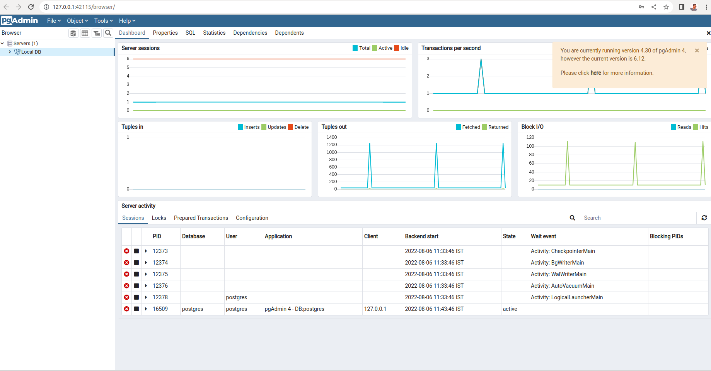

## Celery-Django-Postgres-Redis
### Installing postgres in ubuntu
    Referenceurl : https://www.postgresql.org/download/linux/ubuntu/
    
    # Create the file repository configuration:
    sudo sh -c 'echo "deb http://apt.postgresql.org/pub/repos/apt $(lsb_release -cs)-pgdg main" > /etc/apt/sources.list.d/pgdg.list'
    
    # Import the repository signing key:
    wget --quiet -O - https://www.postgresql.org/media/keys/ACCC4CF8.asc | sudo apt-key add -
    
    # Update the package lists:
    sudo apt-get update
    
    # Install the latest version of PostgreSQL.
    # If you want a specific version, use 'postgresql-12' or similar instead of 'postgresql':
    sudo apt-get -y install postgresql
    
### Installing pg admin
    
    # Installing from ubuntu software center
    # updating the postgres password
    csk@csk-ai-revolution:~$ sudo -u postgres psql template1
    psql (13.3 (Ubuntu 13.3-1.pgdg16.04+1))
    Type "help" for help.
    
    template1=# ALTER USER postgres PASSWORD 'postgres';
    ALTER ROLE
    template1=# \q
    # Pg admin UI
    
     username:postgres
     password:postgres